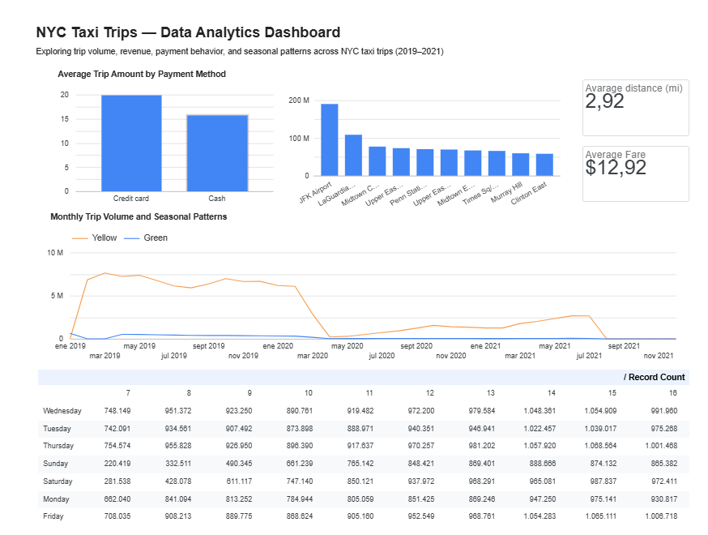

# NY-taxi
Pipeline and Analysys of the New York taxi drives public dataset.

The data is here https://www.nyc.gov/site/tlc/about/tlc-trip-record-data.page


## Terraform

Terraform is used to manage the Google Cloud infrastructure required by the data pipeline.

The current configuration manages:

* A Google Cloud Storage bucket
* A BigQuery dataset

### Prerequisites

* Terraform installed
* A Google Cloud project
* A Google Cloud service account with the required permissions
* GCP credentials configured locally

### Configuration

Create a local `terraform.tfvars` file from the example:

```bash
cp terraform/terraform.tfvars.example terraform/terraform.tfvars
```

Then add the appropriate values for:

```hcl
project_id  = "your-gcp-project-id"
region      = "us-central1"
bucket_name = "your-bucket-name"
dataset_id  = "your-dataset-id"
```

The `terraform.tfvars` file and GCP credentials are excluded from Git.

### Initialize Terraform

From the project root:

```bash
cd terraform
terraform init
```

### Review the infrastructure

To preview the changes Terraform would make:

```bash
terraform plan
```

### Apply the configuration

To create or update the infrastructure:

```bash
terraform apply
```

Review the proposed changes and type `yes` to confirm.

### Project-specific note

The GCS bucket and BigQuery dataset used in this project were already created in Google Cloud and were imported into Terraform state. Therefore, running `terraform plan` against the current configuration should show no changes when the infrastructure is already synchronized with Terraform.

## Docker: Kestra and dbts

Docker Compose is used to run Kestra and the dbt pipeline in a containerized environment.

The project includes:

* Kestra for workflow orchestration and scheduling
* dbt for data transformation in BigQuery
* A Kestra flow in flows/ for the GCP taxi pipeline

### How to run

Clone the repository:

```bash
git clone https://github.com/kj-data/nyc-taxi-end-to-end-pipeline.git
cd nyc-taxi-end-to-end-pipeline
```

Configure the required GCP credentials and dbt connection settings locally.

Start Kestra and dbt:


```bash
docker compose up --build
```

GCP credentials are excluded from Git and must be configured locally.

### Data Quality Testing

The dbt project includes **34 data quality tests**, covering uniqueness, null checks, accepted values, referential integrity, and custom business rules.

The custom test `trips_invalid_time_with_fare` identifies trips where:

* pickup time is equal to or later than dropoff time,
* fare amount is greater than 0, and
* trip distance is non-zero.

The test currently identifies **44 anomalous trips** requiring further investigation.

**Latest dbt test run:** 34 tests — **33 passed, 1 failed** (44 rows identified by the custom business-rule test).

### Continuous Integration (CI)

The project includes a simple **Continuous Integration (CI)** workflow using GitHub Actions to automatically validate the dbt project when changes are pushed to the `main` branch or submitted through a pull request.

The workflow:

1. Checks out the repository.
2. Sets up Python 3.11.
3. Installs `dbt-bigquery`.
4. Installs the dbt dependencies.
5. Runs `dbt parse` to validate the dbt project structure and configuration.

The workflow is configured to run when files under the `dbt/` directory are modified.

This provides an automated validation step before changes are considered ready, helping detect dbt configuration or parsing errors early in the development workflow.


## Dashboard

The final dashboard is available here:

**[NYC Taxi Analytics Dashboard](https://datastudio.google.com/s/rXgknptOQNs)**

A screenshot of the dashboard is also included in the repository for reference:



## Questions the Dashboard Answers

This Looker Studio dashboard analyzes New York City taxi trips from 2019 to 2021 to answer the following business questions:

1. **What is the size and typical value of a trip?**
   The scorecards show the average trip distance (in miles) and the average fare per trip.

2. **How does demand change over time?**
   The time series chart shows monthly trip volume for Yellow and Green taxis, making it easy to spot seasonality and the sharp drop in 2020.

3. **Which days and hours have the highest demand?**
   The pivot table of weekday by pickup hour reveals peak hours and the busiest days of the week.

4. **Which zones generate the most revenue?**
   The top 10 zones by total amount show where the business is concentrated, with the airports (JFK and LaGuardia) leading.

5. **How do passengers pay?**
   The payment method chart compares the total amount between credit card and cash.